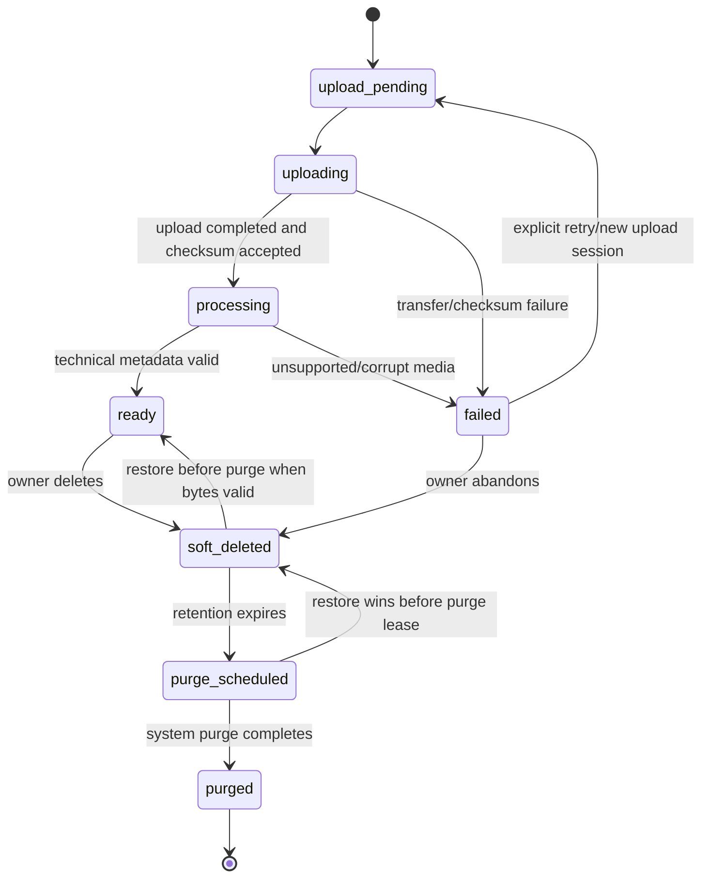

# Asset Lifecycle

## States

## Transition contract

| Transition             | Preconditions                                                                | Side effects and audit                                                                                             |
| ---------------------- | ---------------------------------------------------------------------------- | ------------------------------------------------------------------------------------------------------------------ |
| Initialize upload      | Active member owns active Project; filename/type/size valid; quota available | Create Asset `upload_pending`; generate server storage key and upload capability; audit `asset.upload_initialized` |
| Start/continue upload  | Valid upload capability and Asset state                                      | Mark `uploading`; bytes may be multipart/direct-to-storage                                                         |
| Complete upload        | Declared size/checksum match stored object                                   | Persist checksum/size; move to `processing`; queue durable metadata extraction                                     |
| Process                | Lease-scoped worker; object exists                                           | Validate media/container; store technical metadata; move to `ready` or typed `failed`                              |
| Retry failed ingestion | Owner, retryable cause, quota and object/session policy valid                | New attempt/session; never mark ready from stale success                                                           |
| Soft delete            | Owner authorization; no protected active operation                           | Set `deletedAt`; hide from active search; invalidate new use capabilities                                          |
| Restore                | Retention active, object/checksum still valid, Project active/restored       | Return to `ready`; audit restore                                                                                   |
| Schedule/purge         | Retention expired; system job only                                           | `purge_scheduled`; delete bytes idempotently; mark `purged`; audit result                                          |

## Invariants

- Only `ready` assets can appear in CompositionVersion references.
- Original filename is metadata, not identity or storage location; duplicates are valid.
- Search uses only original filename, media type, upload time, Project, and optional ingestion status.
- Owner/project checks occur before object lookup or signed URL creation.
- Missing bytes never automatically change canonical state; a reconciler records a typed failure through a guarded transition.
- MVP has no shared/global asset library, semantic analysis, OCR/transcript search, or duplicate-cleanup workflow.
