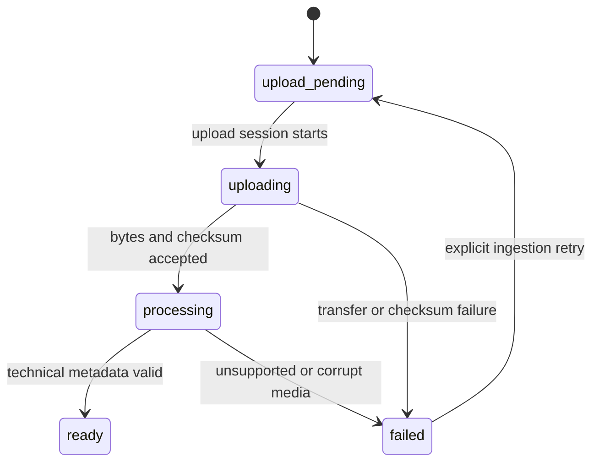
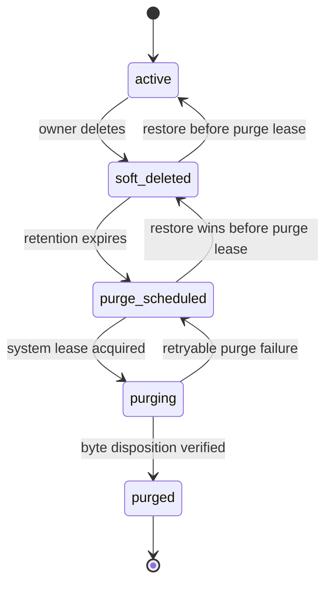

# Asset Lifecycle

Status: Slice 3D implemented, merged, and production cutover complete. Feature merge `c04576b5d905c2ef55997c53a90ed84e06512564`; forward correction `ce6f51845013c41c1906080354e631c026862cfd`; production schema v5 and normal HF-restart private Asset durability verified.

## Independent state axes

Asset ingestion records the result of receiving and inspecting media:

Asset lifecycle records user intent and retention independently:

A new Asset is `upload_pending + active`. Only `ready + active` is referenceable. Lifecycle transitions never pretend that ingestion succeeded or failed, and ingestion retry does not restore a deleted Asset.

## Transition contract

| Operation              | Preconditions                                                                | State and side effects                                                                                                  |
| ---------------------- | ---------------------------------------------------------------------------- | ----------------------------------------------------------------------------------------------------------------------- |
| Initialize upload      | Active member owns active Project; filename/type/size valid; quota available | Create `upload_pending + active`; generate server storage key and upload capability; audit initialization               |
| Start/continue upload  | Valid upload capability; lifecycle is `active`                               | Ingestion becomes `uploading`; bytes may be multipart/direct-to-storage                                                 |
| Complete upload        | Declared size/checksum match stored object                                   | Persist checksum/size; ingestion becomes `processing`; queue durable metadata extraction                                |
| Process                | Lease-scoped worker; object exists; lifecycle permits work                   | Validate media/container and metadata; ingestion becomes `ready` or typed `failed`                                      |
| Retry failed ingestion | `failed + active`; retryable cause, quota, and object/session policy valid   | Ingestion returns to `upload_pending` with a new attempt/session; lifecycle remains `active`                            |
| Soft delete            | Owner authorization; lifecycle is `active`                                   | Lifecycle becomes `soft_deleted`; ingestion is unchanged; hide from active search and invalidate new use capabilities   |
| Restore                | Before purge lease; Project active/restored                                  | Lifecycle returns to `active`; ingestion is unchanged, so `ready + soft_deleted` becomes `ready + active`               |
| Schedule purge         | Retention expired; system job only; lifecycle `soft_deleted`                 | Lifecycle becomes `purge_scheduled`; ingestion is unchanged                                                             |
| Purge                  | System worker owns purge lease and manifest                                  | Lifecycle becomes `purging`, bytes are removed idempotently, then lifecycle becomes `purged`; ingestion remains history |

## Search and trash

Basic MVP search may filter original filename, media type, upload time, Project, `ingestionStatus`, and `lifecycleStatus`. Active-library queries default to `lifecycleStatus=active`; trash queries use `soft_deleted` and `purge_scheduled` as appropriate. Search filtering never makes a non-referenceable asset eligible for composition use.

## Invariants

- Only `ready + active` Assets can appear in new CompositionVersion references.
- `failed + active` may retry ingestion. `ready + soft_deleted` may restore to `ready + active`. Restore never changes `failed` to `ready`.
- Purge changes lifecycle and byte availability only; it preserves the historical ingestion outcome until record-retention policy removes or redacts it.
- Original filename is metadata, not identity or storage location; duplicates are valid.
- Owner/project checks occur before object lookup or signed URL creation.
- Missing bytes never automatically change canonical state; a reconciler records a typed failure through a guarded transition.
- MVP has no shared/global asset library, semantic analysis, OCR/transcript search, or duplicate-cleanup workflow.
