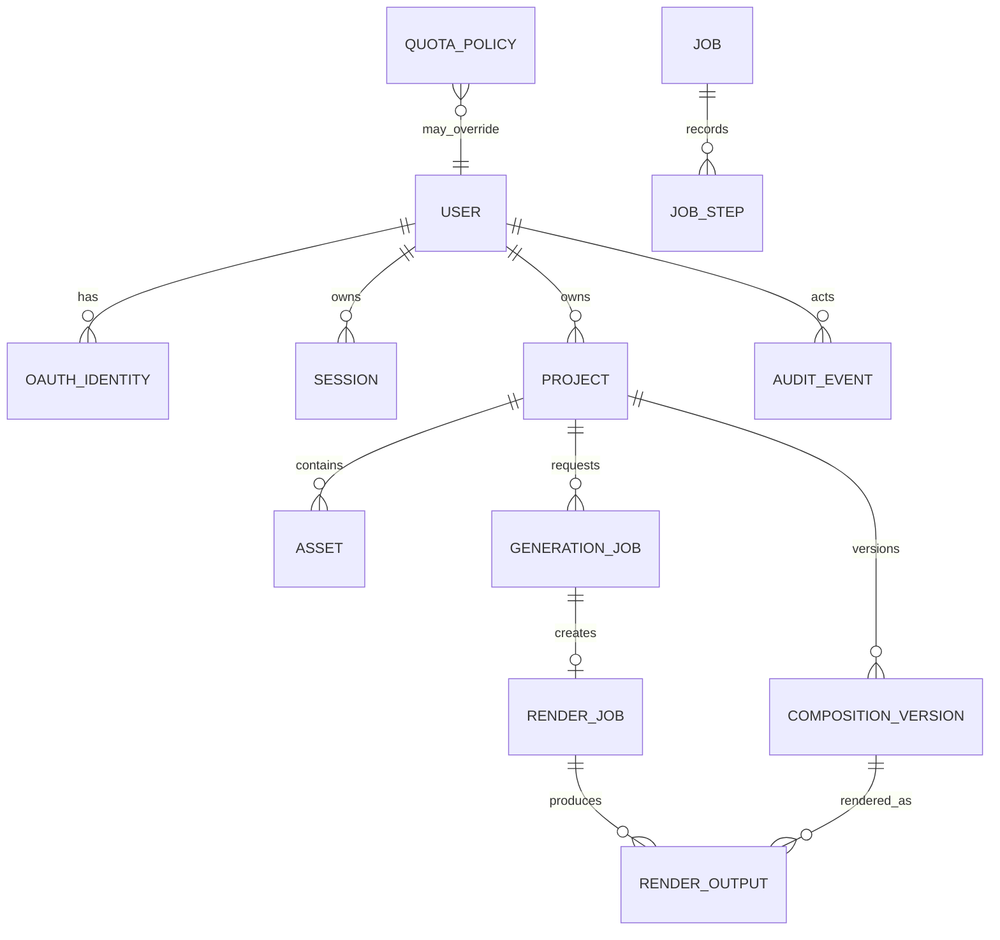

# MVP Domain Model

## Purpose

This document defines canonical product entities for Oloka Video MVP. Database state is authoritative for business state; object storage owns bytes only. Log text, filesystem paths, object existence, and browser state never determine lifecycle state.

All IDs are opaque, server-generated, globally unique identifiers. Timestamps are UTC instants. Domain records use optimistic concurrency or equivalent transaction guards. No Workspace entity exists in MVP.

## Aggregate map

`JOB` is a logical durable aggregate with a `jobType` discriminator. `GenerationJob` and `RenderJob` are typed subtypes sharing state, lease, heartbeat, idempotency, cancellation, retry, and step semantics. This decision is recorded in ADR 0009.

## User

| Field                      | Contract                                              |
| -------------------------- | ----------------------------------------------------- |
| `id`                       | Opaque ID                                             |
| `email`                    | Normalized Google email; unique under identity policy |
| `displayName`, `avatarUrl` | Profile presentation fields                           |
| `status`                   | `pending`, `active`, `disabled`, `rejected`           |
| `role`                     | `member`, `admin`                                     |
| `approvedAt`, `approvedBy` | Required after approval                               |
| `disabledAt`               | Set when disabled                                     |
| `createdAt`, `updatedAt`   | Audit timestamps                                      |

An authenticated Google identity creates a `pending` user. `disabled` and `rejected` users retain records and audit history. Access revocation does not hard-delete the user.

## OAuthIdentity

Fields: `id`, `userId`, `provider`, `providerSubject`, `providerEmail`, `createdAt`, `updatedAt`. MVP permits only `provider=google`. `(provider, providerSubject)` is unique. Long-lived access tokens are not stored unless a later capability requires them.

## Session

Fields: `id`, `userId`, `tokenHash`, `expiresAt`, `revokedAt`, `createdAt`, `lastSeenAt`, `ipHash`, `userAgentSummary`. The browser receives only a secure cookie containing the raw bearer value; storage keeps its hash. Logout, user disable, and security action can revoke sessions immediately.

## Project

| Field                         | Contract                                                         |
| ----------------------------- | ---------------------------------------------------------------- |
| `id`, `ownerId`               | Opaque identity and single owner                                 |
| `name`, `description`         | Mutable presentation fields                                      |
| `favorite`                    | List-organization boolean only                                   |
| `status`                      | `active`, `soft_deleted`, `purge_scheduled`, `purging`, `purged` |
| `currentCompositionVersionId` | Nullable pointer to an immutable version in this project         |
| `deletedAt`, `purgeAfter`     | Soft-delete and retention timestamps                             |
| `createdAt`, `updatedAt`      | Audit timestamps                                                 |

Project status is independent of generation/render job status. A project never uses name, slug, storage key, or filesystem path as identity. There is no `posted` field and no special project named `workspace`.

## Asset

Fields: `id`, `ownerId`, `projectId`, `storageKey`, `originalFilename`, `mimeType`, `mediaType`, `sizeBytes`, `checksum`, `ingestionStatus`, `technicalMetadata`, `createdAt`, `deletedAt`.

`mediaType` is a controlled value such as `image`, `video`, or `audio`. `ingestionStatus` follows the lifecycle in `ASSET_LIFECYCLE.md`. `storageKey` is generated server-side and is never accepted as authorization input from a client. Duplicate filenames are permitted. Searchable MVP fields are original filename, media type, upload time, project, and optional ingestion status.

## CompositionVersion

Fields: `id`, `projectId`, `versionNumber`, `schemaVersion`, `document`, `dependencyManifest`, `fontManifest`, `rendererVersion`, `createdByUserId`, `createdByJobId`, `createdAt`.

The entity is immutable. Any structured edit creates the next version transactionally and may update `Project.currentCompositionVersionId`. The canonical `document` is structured data, never arbitrary HTML/CSS/JavaScript.

## Job base and GenerationJob

Every Job has: `id`, `jobType`, `projectId`, `requestedByUserId`, `idempotencyKey`, `state`, `currentStep`, `progress`, `attempt`, `leaseOwner`, `leaseExpiresAt`, `heartbeatAt`, `cancelRequestedAt`, `errorCode`, `errorDetailsSafe`, `createdAt`, `startedAt`, `completedAt`, `updatedAt`.

`GenerationJob` adds `baseCompositionVersionId` and generation request/checkpoint references. One project may have many jobs. Idempotency uniqueness is scoped to requester and command semantics, not project ID.

## JobStep

Fields: `id`, `jobId`, `stepName`, `state`, `attempt`, `inputArtifactReferences`, `outputArtifactReferences`, `providerOperationId`, `idempotencyKey`, `lease`, `timeoutAt`, `errorCode`, `startedAt`, `completedAt`.

Step artifacts are immutable references. Completed steps cannot be silently rewritten. Per-scene narration tasks are durable child step records or an equivalent normalized task collection.

## RenderJob

`RenderJob` is a `jobType=render` subtype of Job. It adds `compositionVersionId`, `renderProtocolVersion`, requested dimensions, provider credential reference, bundle reference, and provider operation ID. A GenerationJob creates or idempotently reuses a child RenderJob during `submit_render`. User-triggered rerender may create a standalone RenderJob against an existing CompositionVersion.

## RenderOutput

Fields: `id`, `projectId`, `compositionVersionId`, `renderJobId`, `storageKey`, `checksum`, `sizeBytes`, `durationMs`, `width`, `height`, `videoCodec`, `audioCodec`, `availabilityState`, `technicalStatus`, `visualReviewStatus`, `humanApprovalStatus`, `rendererVersion`, `retentionState`, `pinned`, `createdAt`, `deletedAt`.

RenderOutput is immutable. The allowed quality values are:

- `technicalStatus`: `pending`, `passed`, `failed`.
- `visualReviewStatus`: `not_reviewed`, `passed`, `failed`.
- `humanApprovalStatus`: `not_required`, `pending`, `approved`, `rejected`.

Playback/download is allowed only when availability is `verified`, technical status is `passed`, and authorization succeeds.

## ProviderCredentialReference

Fields: `id`, `providerType`, `credentialReference`, `status`, `lastHealthCheckAt`, `lastHealthStatus`, `createdAt`, `updatedAt`. `credentialReference` points to a secret manager or platform secret; normal domain tables and read APIs never contain plaintext secrets.

## AuditEvent

Fields: `id`, `actorType`, `actorId`, `action`, `targetType`, `targetId`, `safeMetadata`, `createdAt`. Events are append-only and exclude raw secrets, tokens, stack traces, provider payloads, storage paths, and sensitive personal data.

## QuotaPolicy

Fields: `id`, `scopeType`, `scopeId`, `limits`, `effectiveFrom`, `effectiveUntil`, `createdBy`, `createdAt`, `updatedAt`. Environment defaults establish the baseline; an active admin policy may override named limits. Routes and UI consume a quota service and never embed limit constants.

## Cross-entity invariants

1. Owner IDs on Project and Asset must agree; an Asset cannot move across owners or projects in MVP.
2. CompositionVersion, GenerationJob, RenderJob, and RenderOutput must reference the same Project lineage.
3. `currentCompositionVersionId` must belong to the same active Project.
4. Storage keys are created from server-side identity and never supplied as trusted client identifiers.
5. A terminal Job never returns to a non-terminal state.
6. A purged Project cannot be restored; purge is performed only by a durable system job.
7. Object presence can confirm availability but cannot create or change canonical business state without a guarded transition.
