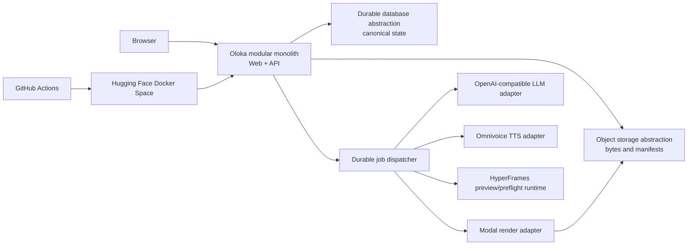

# MVP System Boundary

## Topology

The hosted MVP is one GitHub-to-GitHub-Actions-to-Hugging-Face Docker Space topology. The application uses database and object-storage abstractions and Modal for final render. Build SHA and protocol versions are exposed through safe runtime metadata.

## Inside the product boundary

- Closed-beta Google authentication, revocable sessions, user approval/status.
- Project list/CRUD, favorite, soft delete/restore and scheduled purge.
- Private project assets, upload/ingestion, technical metadata and basic search.
- Prompt/config input, durable generation/render jobs, structured composition versions.
- Read-only preview, basic structured editor, captions, voice, manual BGM/volume/ducking.
- Modal render, technical gate, immutable output playback/download.
- Admin users, safe failed-job diagnostics, provider credential references/health, quota policy and audit.

## Explicitly outside

No Workspace, password/GitHub auth, anonymous product access, global asset library, URL/web ingestion, semantic/AI asset enrichment, full visual Studio, arbitrary code/HTML/CSS editing, AI multi-turn edit, smart BGM, social publishing/`posted`, Cloudflare/D1/R2 topology, local product render option, collaboration, advanced undo/redo, or visual AI/human approval requirement.

## Trust boundaries

- Browser is untrusted; it receives no provider/storage secrets and supplies no trusted paths/keys.
- Database is canonical for identity, authorization, lifecycle, jobs, and output state.
- Object storage is untrusted as a state oracle; checksums and guarded transitions establish availability.
- Providers are external and unreliable; typed adapters, deadlines, idempotency, and state machine isolate them.
- System workers require scoped leases; admin actions require explicit policy and AuditEvents.

## Deployment gates

CI validation must succeed before HF sync. Runtime metadata includes Git source SHA. Health/liveness is separate from readiness of database/storage/providers. Cloudflare does not appear in the MVP architecture or deployment contract.

## Phase 2 technical choices still open

Phase 1 fixes behavior and boundaries but intentionally leaves these implementation choices to Phase 2: production database adapter/engine activation and migration mechanics; concrete object-storage provider and multipart protocol; durable dispatcher/outbox technology and lease intervals; secret-manager implementation; exact CSRF/cookie deployment settings; concrete JSON schema and generated typed contracts; provider model/voice mappings and sandbox accounts; codec allowlist/duration tolerances; preview worker isolation; purge scheduler technology; and capacity tuning from measured development traffic. None may change the accepted product decisions without a new ADR.
