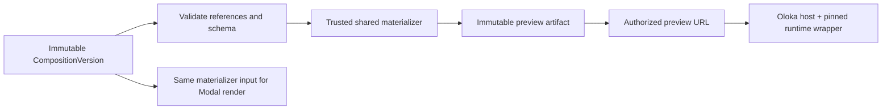

# Preview Runtime V1

## Decision

Each valid immutable `CompositionVersion` maps through one shared trusted materializer to an immutable, checksum-addressed preview artifact. An authorized preview bootstrap loads that artifact into a sandboxed iframe/player. Preview and render consume the same structured document, asset checksums, registry versions, materializer, timing semantics, fonts, and layout presets.

## Technical preview materialization budget

Phase 3F applies a fixed preview-only materialization budget of 16 MiB (`16 * 1024 * 1024`) for the total raw bytes embedded from referenced Assets. The service sums authoritative database sizes before opening any Asset stream and rejects larger previews with `PAYLOAD_TOO_LARGE`. This budget protects the immutable preview path; it is not an upload admission rule. Asset upload admission remains governed by the private-asset policy and its 500 MB maximum.

## HyperFrames fit verification

The official HyperFrames repository exposes core/runtime/player packages and describes deterministic HTML rendered to video. The local HyperFrames skills confirm:

- render-critical state must be seekable from time; no clocks, unseeded randomness, input state, required runtime network fetch, or infinite loops;
- `hyperframes preview` is a long-running Studio development server, while `hyperframes play` uses the embeddable `<hyperframes-player>`;
- CLI lint/check/preview/render are useful verification surfaces, but Studio is an editor/review tool, not a tenant-isolated production service.

The official `@hyperframes/player@0.7.104` and `@hyperframes/core@0.7.104` packages fail Oloka's secure production compatibility gate: the player grants `allow-scripts allow-same-origin`, embeds a jsDelivr runtime fallback, and core transitively declares `@hyperframes/studio-server`. This is an architecture/security incompatibility, not an npm vulnerability finding. Oloka therefore does not install those packages in production and does not weaken its boundary to fit them.

Phase 3F.0 authorizes an Oloka-owned minimal host/player and materialization adapter using reviewed HyperFrames behavior, with the exact `HyperFrames 0.7.104` runtime artifact vendored at `third_party/hyperframes/v0.7.104/hyperframe.runtime.iife.js`. This is a narrow compatibility implementation, not a general HyperFrames fork. The host creates the iframe itself with `sandbox="allow-scripts"`; it never uses `allow-same-origin`, a CDN fallback, Studio, a CLI server, or a persistent preview daemon.

The compatibility fixture is self-contained and network-denial tested. Full Composition V1/v7 materialization is implemented for review with the vendored runtime, deterministic hash CSP, bundled OFL Noto Sans bytes, structured captions/BGM/transitions, and no iframe HTTP(S) dependency. Production remains schema v6 until cutover.

Official source: <https://github.com/heygen-com/hyperframes>.

## Artifact and authorization

- Artifact inputs are only validated structured composition, authorized immutable asset bytes, approved registries/fonts, and trusted runtime code.
- Runtime provenance records upstream `heygen-com/hyperframes` release `v0.7.104`, commit `c96b30c7174984e684620556ce871a285381ec60`, the exact local path, SHA-256, and Apache-2.0 license handling in `third_party/hyperframes/PROVENANCE.json`.
- The artifact fingerprint includes composition canonical hash, ordered asset byte checksums, registry/template/font versions, materializer/runtime version, and CSP profile version.
- It is stored under an opaque key and registered in `preview_artifacts`; users see only preview IDs.
- `GET /api/v1/previews/:id` is owner-only and returns a no-store bootstrap.
  Admin has no owner-preview route. Artifact bytes use authenticated delivery or
  a five-minute resource/operation-scoped opaque capability.
- A project/user lifecycle change can revoke delivery without changing immutable artifact bytes.

## Browser isolation

The preview frame is read-only and receives the minimum sandbox permissions. Initial policy: `sandbox="allow-scripts"` with a sandboxed unique origin, scripts only for the trusted bundled runtime, no top navigation, forms, popups, downloads, pointer-lock, presentation, same-origin privilege, or storage APIs. Parent communication uses an allowlisted versioned `postMessage` protocol with exact iframe `contentWindow` source identity, random per-bootstrap channel, strict Zod validation, and data validation. Opaque-origin `event.origin === "null"` is never accepted by itself.

CSP is generated by the server and at minimum uses `default-src 'none'`; inline scripts/styles are authorized by deterministic SHA-256 hashes, and blob/data media/font bytes are deliberately packaged by the materializer. Network connections, arbitrary images/fonts/media, frames, objects, base URI, and form actions are denied unless resolved into bundled authorized bytes. The production artifact has no arbitrary external network path. The bootstrap channel is generated only by the parent at mount time and is never persisted.

## Read-only behavior

Preview controls may seek, play/pause, change preview playback rate, mute, and report current time/duration. They cannot mutate composition state. Editor actions create a new `CompositionVersion`; refreshing an old preview continues to show the same immutable version. The player reports safe runtime errors to the parent; it receives no session cookie or provider secret.

## Parity and gates

Before artifact readiness, validate Composition Schema V1, registry/materialization completeness, all referenced bytes/checksums, approved fonts, deterministic duration/timeline, exact frame preset, and HyperFrames lint/check. Snapshot tests compare selected timestamps, including first/last frame and transition boundaries. Render provenance records the identical fingerprint; a mismatch fails render admission rather than labeling non-parity output successful.

Known unavoidable differences (browser color/codec playback versus server encoder) must be bounded by technical-quality tolerances and surfaced as metadata. Preview never claims final encoding quality.

## Failure and cleanup

Materialization timeout, validation failure, missing asset, runtime version mismatch, or artifact checksum mismatch produces a stable failed job/event and no preview URL. Quarantined artifacts are not delivered. Bounded worker TTL/lease recovery and stale temp cleanup use durable jobs. No progress is inferred from an iframe timer.

The artifact row records composition version, render-contract fingerprint,
materializer version, HyperFrames version, CSP profile version, storage key,
byte checksum, status, creation time, and purge deadline. A change to any
materializer/HyperFrames/CSP/manifest/fingerprint input creates a new historical
artifact; it never overwrites the prior bytes.
