# Project Lifecycle

## States

```mermaid
stateDiagram-v2
  [*] --> active: create
  active --> active: rename / favorite / edit
  active --> soft_deleted: delete
  soft_deleted --> active: restore within 30 days
  soft_deleted --> purge_scheduled: retention expires
  purge_scheduled --> soft_deleted: restore before purge lease
  purge_scheduled --> purging: system job acquires lease
  purging --> purge_scheduled: retryable purge failure
  purging --> purged: manifest complete; minimal tombstone retained
  purged --> [*]
```

## Operations

| Operation        | Contract                                                                                                                                                                    |
| ---------------- | --------------------------------------------------------------------------------------------------------------------------------------------------------------------------- |
| Create           | Server creates one canonical DB record with opaque ID and owner. No directory, special project, or generation job is required to define existence. Audit `project.created`. |
| Rename           | Owner updates display name under concurrency guard. Name does not change identity/storage keys. Audit safe old/new metadata.                                                |
| Favorite         | Owner toggles boolean. It has no effect on authorization, lifecycle, generation, retention, or publishing.                                                                  |
| Soft delete      | Set `status=soft_deleted`, `deletedAt=now`, `purgeAfter=now+30d`; hide from active list; do not recursively delete bytes in request.                                        |
| Restore          | Owner restores before purge lease starts; clear deletion timestamps as policy specifies; verify dependent resources asynchronously when needed.                             |
| Retention expiry | Scheduler creates idempotent purge job and moves to `purge_scheduled`.                                                                                                      |
| Purge            | System worker with lease removes dependent private bytes and active domain records by manifest, retains the minimal Project tombstone and audit trail, and marks `purged`.  |
| Purge failure    | Keep `purge_scheduled`, record typed safe error, retry with backoff; never report purged while objects remain unaccounted for.                                              |

## Concurrency and audit

Restore and purge acquisition use an atomic state/version guard. Once `purging` begins, ordinary restore is rejected with a stable conflict. Every create, rename, favorite, delete, restore, schedule, purge attempt, failure, and completion produces an AuditEvent. Purge audit metadata includes policy/version and counts/checksums, not storage paths.

After purge, the canonical Project row is a non-restorable tombstone containing opaque `id`, owner reference or privacy-safe owner lineage, `status=purged`, `purgedAt`, `retentionPolicyVersion`, and safe audit references. User-facing presentation fields may be redacted. Purge removes dependent private bytes and active domain records according to the durable manifest, but it never removes the audit trail needed to explain the action.

## Prohibitions

No Workspace entity, `workspace` alias, hidden default Project, `meta.json` canonical record, path identity, client filesystem path, synchronous recursive delete, state inference from bytes, hard delete for ordinary user action, or `posted` field exists in MVP.
