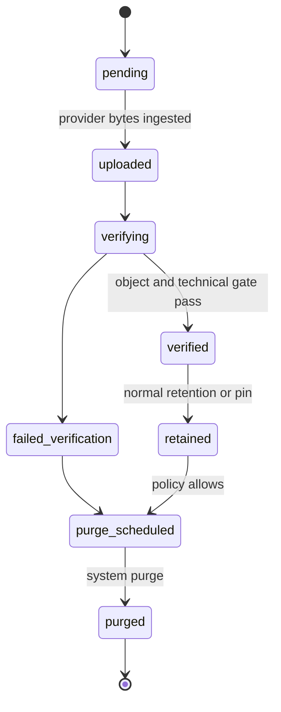

# Render Output Contract

## Purpose

RenderOutput is an immutable, authorized record of one verified render result. It replaces mutable `output.mp4` semantics and file-derived completion state.

## Lifecycle

No playback/download capability exists before `verified`.

## Required record

The entity contains `id`, `projectId`, `compositionVersionId`, `renderJobId`, `storageKey`, `checksum`, `sizeBytes`, `durationMs`, `width`, `height`, `videoCodec`, `audioCodec`, `availabilityState`, `technicalStatus`, `visualReviewStatus`, `humanApprovalStatus`, `rendererVersion`, `retentionState`, `pinned`, `createdAt`, and `deletedAt`.

Lineage must prove that Project, CompositionVersion, RenderJob, bundle checksum, renderer/protocol versions, and output belong to the same authorized request.

## Technical verification gate

Before `verified`, the system checks:

1. Object exists through the storage abstraction and is available.
2. Size is non-zero and checksum matches the ingested record.
3. Media container is readable and has a video stream.
4. Width/height match the request; duration is within versioned tolerance.
5. Video codec is allowlisted; audio presence/codec meets request requirements.
6. Required Asset references are represented in the frozen manifest.
7. Composition schema, render protocol, font manifest, renderer, and HyperFrames versions match the preflight contract.

`technicalStatus=passed` is mandatory for success. Visual AI remains `not_reviewed`; human approval defaults to `not_required` in MVP. These fields never collapse into `qualityPassed`.

## Delivery

Playback/download requests authorize by RenderOutput ID, then derive a short-lived storage capability server-side. The response never trusts a client storage key. Cache/version identity is the immutable output ID/checksum. Download filenames may include sanitized Project metadata but do not affect identity.

## Retry and immutability

A render retry normally creates a new RenderJob and RenderOutput. Idempotent reuse is allowed only when the command hash, CompositionVersion, bundle checksum, provider operation, renderer version, and resulting checksum are identical and the existing output is still verified. No output bytes or metadata are overwritten.

## Retention

At most 10 outputs per Project are retained by default. Pinned outputs are excluded from automatic eviction. Final outputs remain while the Project exists; soft-deleted Project policy and purge job govern deletion. Failed/unpublished artifacts follow intermediate-artifact retention.
