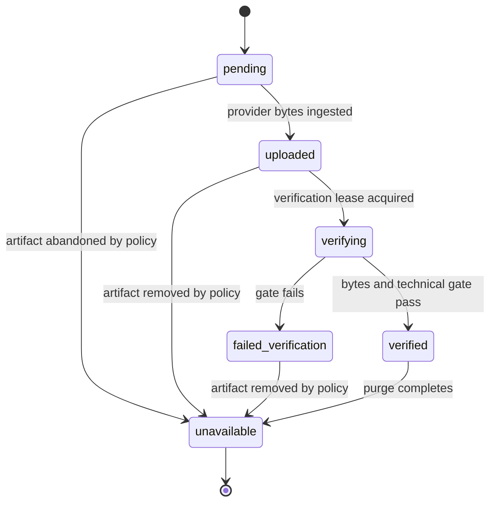
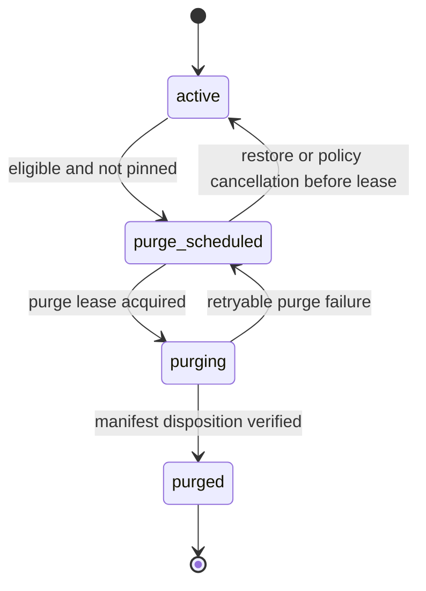

# Render Output Contract

## Purpose

RenderOutput is an authorized record with immutable output identity, bytes, media metadata and lineage. Guarded lifecycle and review fields may change without changing that immutable core. This contract replaces mutable `output.mp4` semantics and file-derived completion state.

## Independent lifecycle axes

Availability describes whether verified bytes can be served:

Retention independently describes policy and purge execution:

`pinned` is a separate boolean. It blocks automatic `active -> purge_scheduled` but does not change availability or retention state. `verified + active + pinned=true|false` are both valid. Purge completion atomically records `retentionState=purged` and `availabilityState=unavailable`; playback and download are denied thereafter. Object storage existence never causes a state transition.

## Required record

### Immutable core

The immutable core contains:

- Identity and bytes: `id`, `projectId`, `compositionVersionId`, `renderJobId`, `storageKey`, `checksum`, `sizeBytes`, `createdAt`.
- Media metadata: `durationMs`, `width`, `height`, `videoCodec`, `audioCodec`.
- Render lineage: `bundleChecksum`, `compositionSchemaVersion`, `renderProtocolVersion`, `rendererVersion`, `hyperframesVersion`, `dependencyManifestHash`, `assetManifestHash`, `fontManifestHash`, `captionManifestHash`, `renderContractFingerprint`.

The lineage scalars and hashes are stored directly in the immutable RenderOutput snapshot. The bundle and larger immutable manifests are referenced by those hashes. Project, CompositionVersion, RenderJob, bundle, provider operation, and output must belong to the same authorized request.

### Guarded mutable fields

The mutable fields are limited to `availabilityState`, `technicalStatus`, `visualReviewStatus`, `humanApprovalStatus`, `retentionState`, `pinned`, `verifiedAt`, `purgeScheduledAt`, and `purgedAt`.

Every change requires an allowed transition, optimistic-concurrency or lease guard, and an AuditEvent. No lifecycle transition may overwrite identity, bytes, media metadata, or lineage.

Allowed values are:

- `availabilityState`: `pending`, `uploaded`, `verifying`, `verified`, `failed_verification`, `unavailable`.
- `retentionState`: `active`, `purge_scheduled`, `purging`, `purged`.
- `technicalStatus`: `pending`, `passed`, `failed`.
- `visualReviewStatus`: `not_reviewed`, `passed`, `failed`.
- `humanApprovalStatus`: `not_required`, `pending`, `approved`, `rejected`.

## Canonical render lineage

`renderContractFingerprint` is a deterministic hash of a canonically serialized, versioned structure containing `bundleChecksum`, `compositionSchemaVersion`, `renderProtocolVersion`, `rendererVersion`, `hyperframesVersion`, `dependencyManifestHash`, `assetManifestHash`, `fontManifestHash`, and `captionManifestHash`. Field order, normalization, and hash algorithm are fixed by the render protocol version.

The same fingerprint is produced by materialization, preflight, preview, provider submission, and output verification. Verification compares stored lineage with the immutable bundle/manifests and provider result. Preview exposes the fingerprint used for the frame being viewed. A provider adapter rejects unsupported protocol versions or any lineage/fingerprint mismatch before submission rather than attempting a best-effort render.

## Technical verification gate

Before availability becomes `verified`, the system checks:

1. Object exists through the storage abstraction and is available.
2. Size is non-zero and checksum matches the ingested record.
3. Media container is readable and has a video stream.
4. Width/height match the request; duration is within versioned tolerance.
5. Video codec is allowlisted; audio presence/codec meets request requirements.
6. Required Asset references are represented in the frozen asset manifest.
7. Every canonical lineage value and `renderContractFingerprint` matches the preflight contract.

`technicalStatus=passed` is mandatory for success. Visual AI remains `not_reviewed`; human approval defaults to `not_required` in MVP. These fields never collapse into `qualityPassed`.

## Delivery

Playback/download requests authorize by RenderOutput ID, then derive a short-lived storage capability server-side. Delivery additionally requires `availabilityState=verified`, `retentionState=active`, and `technicalStatus=passed`. The response never trusts a client storage key. Cache/version identity is the immutable output ID/checksum. Download filenames may include sanitized Project metadata but do not affect identity.

## Retry and reuse

A render retry normally creates a new RenderJob and RenderOutput. Idempotent reuse is allowed only when Project, CompositionVersion, `bundleChecksum`, render request hash, `rendererVersion`, `renderProtocolVersion`, provider operation identity/idempotency contract, output checksum, and `renderContractFingerprint` all match and the existing output remains `verified + active`. No output bytes, media metadata, or lineage are overwritten.

## Retention

At most 10 outputs per Project are retained by default. Pinned outputs are excluded from automatic purge scheduling. Final outputs remain while the Project exists; soft-deleted Project policy and purge jobs govern deletion. Failed/unpublished artifacts follow intermediate-artifact retention. A purge retry changes only guarded lifecycle state and never manufactures an ingestion or verification result.
