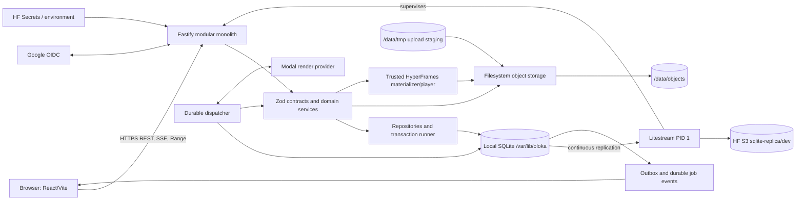

# Technical Architecture V1

Status: Phase 2 blueprint with the accepted Phase 3A.1 durability correction.

## Decision summary

Oloka Video MVP is one TypeScript modular monolith deployed in one Hugging Face Docker Space. Litestream supervises one Node.js 22/Fastify application process. React/Vite is the browser client. SQLite is a local single-writer primary; Litestream transports recovery state to the HF S3 API. The `/data` mount stores object bytes and immutable backups, never the live SQLite database. Modal remains the only planned remote render provider.

This document resolves the choices left open in `MVP_SYSTEM_BOUNDARY.md`; the Phase 1 product and domain contracts remain authoritative where this blueprint is silent.

| Concern    | Locked choice                                                                   | Explicitly excluded from MVP                          |
| ---------- | ------------------------------------------------------------------------------- | ----------------------------------------------------- |
| Runtime    | Node.js 22.16.0 exact reviewed patch, TypeScript ESM, npm workspaces            | floating Node major, second backend, serverless split |
| HTTP/UI    | Fastify 5, React, Vite, Zod contracts                                           | full-stack framework, duplicated API types            |
| Database   | `node:sqlite` at `/var/lib/oloka/database/oloka.db`, one writer                 | ORM, external SQL database, app replicas              |
| Durability | Litestream 0.5.11 to HF S3 `sqlite-replica/dev`                                 | zero-data-loss claim, second app reader/writer        |
| Bytes      | filesystem object adapter rooted beneath `/data`                                | Git-tracked runtime bytes, live SQLite under `/data`  |
| Jobs       | in-process dispatcher with durable SQLite leases/outbox                         | RAM-only queue, message broker                        |
| Preview    | immutable authorized artifact using the trusted HyperFrames materializer/player | arbitrary HTML, per-project permanent preview servers |
| Render     | Modal adapter behind typed provider boundary                                    | local production rendering, provider fan-out          |
| Deploy     | one HF Docker Space, one app instance                                           | Cloudflare runtime, horizontal scale                  |

## Component map

## Module boundaries

| Module                           | Owns                                                  | May depend on                        | Must not do                                            |
| -------------------------------- | ----------------------------------------------------- | ------------------------------------ | ------------------------------------------------------ |
| HTTP transport                   | parsing, authentication hooks, response mapping       | contracts, application services      | SQL or storage paths                                   |
| Contracts (`packages/contracts`) | Zod request/response/domain schemas and error codes   | no server module                     | provider calls or persistence                          |
| Application services             | use-case policy and transaction boundaries            | domain, repositories, provider ports | Fastify reply handling                                 |
| Domain                           | invariants and state transitions                      | shared value objects                 | filesystem, SQL, network                               |
| Repositories                     | parameterized SQLite statements and row mapping       | database boundary, contracts         | business orchestration                                 |
| Object storage                   | opaque key operations and containment                 | filesystem adapter                   | user authorization decisions                           |
| Dispatcher                       | leases, heartbeats, retries, reconciliation           | repositories, application services   | long work inside transactions                          |
| Provider adapters                | typed LLM/TTS/transcription/Modal calls               | provider contracts, secret resolver  | reading arbitrary environment names from requests      |
| Preview runtime                  | deterministic materialization and authorized delivery | composition schema, object storage   | execute user code or fetch arbitrary network resources |
| Observability                    | structured logs and metrics                           | safe context only                    | secrets, tokens, raw provider payloads                 |

## Request and background flow

1. Fastify validates every input with the canonical Zod schema and resolves the session.
2. The application service authorizes the resource and invokes a documented transaction boundary.
3. The transaction writes authoritative state plus outbox/job events atomically.
4. The response returns after commit; slow filesystem/network/provider work is a durable job.
5. The dispatcher claims work with a short `BEGIN IMMEDIATE` lease transaction, performs work outside it, then commits the guarded result.
6. SSE replays `job_events`; polling remains a supported fallback.

## Persistence and concurrency rules

- IDs are UUIDv4 generated with `crypto.randomUUID()`.
- Database timestamps are UTC Unix epoch milliseconds stored as SQLite `INTEGER`.
- Connections enable `foreign_keys=ON`, `journal_mode=WAL`, `synchronous=FULL`, and `busy_timeout=5000`.
- Startup restores the absent local primary before application start. Production requires an explicit `fresh-if-replica-missing` or `restore-required` policy and fails closed on every restore error.
- `node:sqlite` is synchronous. Statements and transactions must be short; provider calls, filesystem streaming, checksums, and media analysis never run while a transaction is open.
- Routes never contain SQL. All writes use a transaction runner and repository interfaces.
- JSON is Zod-validated, schema-versioned, RFC 8785 canonicalized UTF-8 text. Search/filter/join fields remain normal columns.
- Optimistic concurrency uses integer `version` fields and `If-Match` or `expectedVersion`.

## Trust boundaries

- Browser input, upload bytes, provider responses, provider callbacks, and stored JSON are untrusted until validated.
- `/data` is never mounted as public static content. API authorization resolves a resource ID to a server-owned opaque key.
- Actual provider secrets exist only in HF Space Secrets/environment. Database rows store references to environment variable names, never values.
- Preview accepts only the structured Composition Schema V1. It cannot contain raw HTML/CSS/JavaScript, arbitrary URLs, or unknown fonts/styles.
- Operator-only health endpoints expose readiness without secret or tenant data.

## Availability and scale envelope

MVP intentionally supports one Space and one application writer. WAL improves read/write overlap; Litestream adds recovery transport, not multi-writer safety. Move to PostgreSQL when any of these become true: more than one application instance is required; sustained lock wait or write latency breaches the NFR; job throughput requires independent workers; backup/recovery objectives require managed point-in-time recovery or an independent failure domain; or dataset/storage growth makes maintenance windows unacceptable. No part of that exit is implemented in Phase 3A.1.

## Source evidence

- Foundation runtime and workspace: `package.json`, `apps/server/package.json`, `apps/web/package.json`, `packages/contracts/package.json`.
- Current process and HTTP composition: `apps/server/src/index.ts`,
  `apps/server/src/app.ts`, `apps/server/src/http/routes.integration.test.ts`.
- Current configuration: `apps/server/src/config/environment.ts` and its unit
  test.
- Current database boundary/adapters:
  `apps/server/src/database/database.ts`,
  `apps/server/src/database/create-database.ts`, and
  `apps/server/src/database/sqlite-system-database.ts`.
- Current storage boundary/adapters: `apps/server/src/storage/object-storage.ts`
  and `apps/server/src/storage/filesystem-object-storage.ts`.
- Current system services: `apps/server/src/system/health-service.ts`,
  `readiness-service.ts`, and `version-service.ts`.
- Deployment topology: `Dockerfile`, `.github/workflows/validation.yml`,
  `.github/workflows/deploy-hf.yml`, and `docs/architecture/DEPLOYMENT.md`.
- Product/domain authority: `docs/product/**`, `docs/architecture/DOMAIN_MODEL.md`, `docs/architecture/JOB_STATE_MACHINE.md`, and ADRs 0001-0016.
