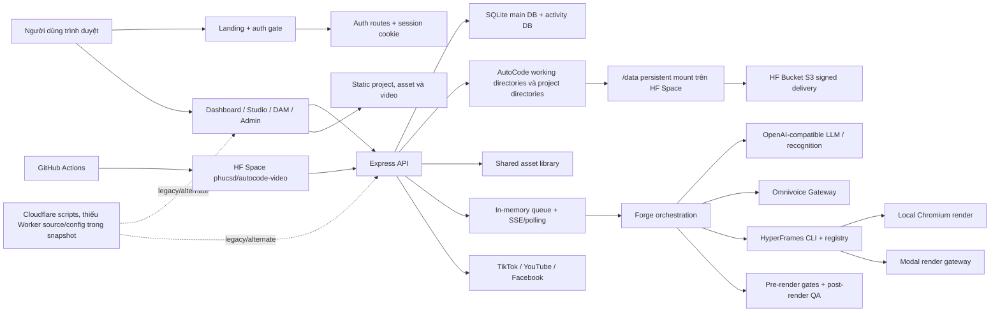

# Bản đồ hệ thống AutoCode Video hiện tại

## Phạm vi và cách đọc

Tài liệu này là kết quả audit clean-room, chỉ mô tả hành vi và ranh giới hệ thống. Nguồn được khảo sát là `phucsd1/AutoCode_Video`, branch `codex/hf-prod-sync`, commit `595ccdfaf45ff83473f2da8fd2c71d491828e5f5`. Không có mã nguồn nào được chuyển sang Oloka Video.

Phase 0.1 dùng hai trục độc lập. Không được suy ra mức xác minh runtime từ mức hoàn chỉnh implementation.

### Implementation status

- **FULL**: source cho thấy entry point, consumer, backend và persistence/provider wiring tương đối đầy đủ.
- **PARTIAL**: có implementation thật nhưng thiếu một hoặc nhiều boundary, durability, permission hoặc journey branch.
- **MOCK**: UI hoặc response mô phỏng; không có side effect thật tương ứng.
- **LEGACY**: implementation còn tồn tại nhưng luồng sản phẩm chính dùng đường khác.
- **UNREACHABLE**: implementation tồn tại nhưng không thể đi tới qua application wiring hiện tại, ví dụ router chưa mount.
- **UNCLEAR**: source chưa đủ để xác định implementation đang được dùng.

### Verification status

- **SOURCE_VERIFIED**: có bằng chứng source như entry point/route, mount, consumer, backend, persistence/provider wiring hoặc test liên quan. Trạng thái này **không** có nghĩa journey đã chạy thành công.
- **RUNTIME_VERIFIED**: Phase 0 đã thực sự chạy black-box, integration hoặc end-to-end và quan sát đầu ra đúng.
- **NOT_RUNTIME_VERIFIED**: có bằng chứng source nhưng Phase 0 chưa chạy hoặc chưa xác minh trong môi trường thực tế.
- **PARTIAL_RUNTIME_EVIDENCE**: Phase 0 quan sát được một phần runtime nhưng chưa hoàn tất toàn bộ journey/provider flow.

Trong audit này, việc thấy test file chỉ là `SOURCE_VERIFIED`; 66 test files của AutoCode Video không được chạy. Không nhóm AutoCode Video nào dưới đây được nâng thành `RUNTIME_VERIFIED` hoặc `PARTIAL_RUNTIME_EVIDENCE`.

| Nhóm bắt buộc làm rõ          | Implementation status           | Verification status                    | Ghi chú Phase 0                                              |
| ----------------------------- | ------------------------------- | -------------------------------------- | ------------------------------------------------------------ |
| Google OAuth                  | FULL có điều kiện cấu hình      | SOURCE_VERIFIED · NOT_RUNTIME_VERIFIED | Không chạy login OAuth thật                                  |
| GitHub OAuth                  | UNCLEAR về consumer             | SOURCE_VERIFIED · NOT_RUNTIME_VERIFIED | Có route nhưng không thấy CTA chính                          |
| LLM generation                | PARTIAL                         | SOURCE_VERIFIED · NOT_RUNTIME_VERIFIED | Không gọi provider thật                                      |
| Omnivoice TTS                 | FULL ở mức source               | SOURCE_VERIFIED · NOT_RUNTIME_VERIFIED | Không tạo TTS job thật                                       |
| HyperFrames preview           | PARTIAL                         | SOURCE_VERIFIED · NOT_RUNTIME_VERIFIED | Không chạy preview journey black-box                         |
| Modal render                  | FULL ở mức source               | SOURCE_VERIFIED · NOT_RUNTIME_VERIFIED | Không tạo render có chi phí                                  |
| Hugging Face storage delivery | PARTIAL                         | SOURCE_VERIFIED · NOT_RUNTIME_VERIFIED | Không kiểm tra object/playback runtime trong Phase 0         |
| Social publishing             | PARTIAL                         | SOURCE_VERIFIED · NOT_RUNTIME_VERIFIED | Không upload lên nền tảng thật                               |
| Cloudflare alternate topology | UNCLEAR/UNREACHABLE từ snapshot | SOURCE_VERIFIED · NOT_RUNTIME_VERIFIED | Chỉ xác minh scripts tham chiếu; thiếu source/config runtime |
| AI asset analysis             | PARTIAL/MOCK fallback           | SOURCE_VERIFIED · NOT_RUNTIME_VERIFIED | Không gọi recognition provider thật                          |
| Vision quality analysis       | PARTIAL                         | SOURCE_VERIFIED · NOT_RUNTIME_VERIFIED | Không chạy vision provider thật                              |

Các từ “active”, “hoạt động” hoặc “đầy đủ” còn xuất hiện khi mô tả AutoCode Video chỉ là mô tả **implementation/reachability trong source**, không phải tuyên bố runtime.

## AutoCode Video thực sự gồm những gì

AutoCode Video là một ứng dụng tạo video bằng prompt theo kiểu all-in-one: landing page, dashboard, API, điều phối job và filesystem cùng chạy trong một tiến trình Node/Express; render nặng có thể chạy cục bộ hoặc được ủy quyền cho Modal. Đơn vị sản phẩm trung tâm là một thư mục project chứa composition HyperFrames, asset, checkpoint, log, metadata và MP4. SQLite là chỉ mục nghiệp vụ và nơi lưu user/session/settings, nhưng không phải nguồn dữ liệu duy nhất của project.

Bằng chứng chính: `server.js`, `services/forgePipelineService.js`, `services/projectService.js`, `services/jobStore.js`, `scripts/db.js`, `Dockerfile`, `.github/workflows/deploy-hf-space.yml`.

## Sơ đồ cấp cao

## Thành phần hiện tại

| Thành phần            | Vai trò quan sát được                                                                                         | Implementation status                                                             | Bằng chứng                                                                                                                    |
| --------------------- | ------------------------------------------------------------------------------------------------------------- | --------------------------------------------------------------------------------- | ----------------------------------------------------------------------------------------------------------------------------- |
| Public landing        | Trình bày sản phẩm, Google login và waitlist                                                                  | Hoạt động một phần; nội dung thật, auth phụ thuộc cấu hình hosted                 | `public/index.html`, `public/landing.js`, `public/landing.css`, `services/hostedEntryPolicy.js`                               |
| Dashboard shell       | Điều hướng Create, Projects, Studio, Assets, Admin và Settings                                                | Hoạt động một phần; shell lớn, nhiều control DAM vượt quá backend                 | `private/dashboard-shell.html`, `public/app.js`, `public/style.css`                                                           |
| Studio editor         | Chỉnh document HyperFrames, upload media, undo/redo, optimistic revision                                      | Hoạt động một phần; source React được bundle thành file rất lớn                   | `src/studio-editor.jsx`, `src/studio-editor-model.js`, `public/studio-editor.js`, `routes/composition.js`                     |
| Express backend       | Static hosting, auth, project scoping, API domain routers, bootstrap services                                 | Đang hoạt động; composition root rất lớn                                          | `server.js`, `routes/**`, `services/**`                                                                                       |
| Auth/user management  | Google/GitHub OAuth, password local, session, waitlist, role/status, admin user CRUD                          | Hoạt động một phần; auth là opt-in, GitHub/password không có entry UI chính       | `auth.js`, `scripts/db.js`, `services/sessionLookupCache.js`, `services/adminAccessPolicy.js`                                 |
| SQLite main DB        | User, Session, Project, Job, ChatHistory, AppSetting                                                          | Đang hoạt động; schema tự tạo/ALTER khi startup                                   | `scripts/db.js`                                                                                                               |
| SQLite activity DB    | Audit API activity, có integrity check và fallback tạm                                                        | Đang hoạt động nhưng có thể tách khỏi persistent DB khi mount lỗi                 | `services/activityEventDatabase.js`, `scripts/db.js`                                                                          |
| Project filesystem    | Nguồn artifact chính: HTML, audio, assets, logs, checkpoints, reports, renders                                | Đang hoạt động; trùng dữ liệu với DB và in-memory state                           | `services/projectService.js`, `services/jobStore.js`, `services/projectDiskSnapshot.js`                                       |
| Shared asset library  | Ảnh/video/audio + sidecar JSON dùng chung toàn hệ thống                                                       | Hoạt động một phần; upload/quản lý chủ yếu admin, file static công khai           | `services/assetLibraryStore.js`, `services/assetCatalogService.js`, `routes/assets.js`, `routes/bgm.js`                       |
| Preview engine        | Static HTML preview trong dashboard và một HyperFrames preview process theo project cho config/Studio tooling | Hoạt động một phần; child process/port/proxy sống trong RAM                       | `server.js`, `public/app.js`, `src/studio-editor.jsx`                                                                         |
| Forge pipeline        | Prompt/asset planning, LLM composition, TTS, transcription, captions, registry materialization, render, QA    | Luồng chính đang hoạt động nhưng monolithic và stateful                           | `services/forgePipelineService.js`, `routes/forge.js`, `services/forgeQualityService.js`                                      |
| Job runtime           | Queue in-memory, concurrency, cancel/pause/resume, SSE và polling                                             | Hoạt động một phần; không durable qua restart                                     | `services/jobRuntimeService.js`, `services/jobStore.js`, `routes/forge.js`, `services/forgeStatusPayload.js`                  |
| Render providers      | Local HyperFrames CLI hoặc Modal gateway                                                                      | Cả hai có implementation; production Docker chọn Modal                            | `services/renderProviders.js`, `deploy/modal-renderer/app.py`, `Dockerfile`                                                   |
| Quality system        | Contract/lint trước render, video sampling/vision QA sau render, feedback/memory                              | Hoạt động một phần; một số nhánh phụ thuộc vision config và flag                  | `services/forgeQualityService.js`, `services/videoQualityService.js`, `routes/quality.js`, `quality-memory/**`                |
| Social publishing     | Upload output lên TikTok, YouTube, Facebook                                                                   | Hoạt động một phần; token do cấu hình cung cấp, không có durable publish job      | `routes/socialPublish.js`, `public/app.js`, `services/sharedConfig.js`                                                        |
| Admin                 | User, activity, jobs, chi phí/token, Modal pricing                                                            | Hoạt động một phần; dữ liệu tổng hợp từ nhiều nguồn                               | `routes/admin.js`, `auth.js`, `services/admin*.js`, `public/app.js`                                                           |
| HF deployment/storage | Một Docker Space phục vụ frontend/backend; `/data` lưu project; signed S3 URL giao video                      | Luồng production chính trong snapshot                                             | `Dockerfile`, `README.md`, `.github/workflows/deploy-hf-space.yml`, `services/hfBucketDelivery.js`                            |
| Cloudflare deployment | Script build static, preflight/smoke/migration R2+D1                                                          | Legacy/alternate và không tái tạo được từ snapshot vì thiếu `deploy/cloudflare-*` | `package.json`, `scripts/build-cloudflare-frontend.mjs`, `scripts/*cloudflare*`, `scripts/migrate-projects-to-cloudflare.mjs` |

## Luồng giao tiếp chính

### 1. Entry và authentication

Express quyết định `/` trả landing hay dashboard dựa trên auth policy. Session dùng cookie `hf_session`; API ngoài `/api/auth/**` đi qua middleware auth nếu `AUTOCODE_AUTH_ENABLED=true`, sau đó project ID được ánh xạ theo user. Static `/projects/**` được kiểm tra quyền riêng, nhưng shared `/assets/**` được phục vụ trước auth middleware.

Bằng chứng: `server.js`, `auth.js`, `services/hostedEntryPolicy.js`.

### 2. Tạo video

Dashboard gửi prompt và cấu hình đến `/api/forge/start`. Router tạo/chọn project, ghi request checkpoint, đưa job vào queue RAM và trả `202`. Frontend nhận tiến độ bằng SSE `/api/forge/events` và fallback polling `/api/forge/status`. Pipeline lần lượt tạo composition, tạo narration, đồng bộ transcript/caption, materialize registry, chạy contract checks, render MP4, hậu kiểm và lưu render history.

Bằng chứng: `public/app.js`, `routes/forge.js`, `services/jobRuntimeService.js`, `services/forgePipelineService.js`, `services/projectService.js`.

### 3. Chỉnh sửa

Có hai đường chỉnh sửa. Studio trực quan đọc/ghi toàn bộ composition document với revision để phát hiện conflict; quick scene edit cập nhật một scene; AI edit gửi prompt tới `/api/forge/edit` và chạy lại phần pipeline cần thiết. Undo/redo là state của editor, còn lịch sử render là bản sao artifact theo lần render.

Bằng chứng: `src/studio-editor.jsx`, `src/studio-editor-model.js`, `routes/composition.js`, `routes/forge.js`, `services/compositionDocumentService.js`, `services/projectService.js`.

### 4. Preview và render

Preview đọc `index.html` trong project và phát trong iframe/UI. Render chính đi qua provider abstraction: local spawn HyperFrames CLI; Modal đóng gói các file render cần thiết thành payload base64, tạo call từ xa, poll, tải MP4 về project. Production Docker mặc định `RENDER_PROVIDER=modal`.

Bằng chứng: `public/app.js`, `server.js`, `services/renderProviders.js`, `services/storage/renderBundleManifest.js`, `deploy/modal-renderer/app.py`, `Dockerfile`.

### 5. Persistence và delivery

Mỗi lần state thay đổi, metadata thường được ghi vào `meta.json`, sau đó đồng bộ bất đồng bộ sang SQLite. `output.mp4` và các snapshot render nằm trong project directory. Khi HF Bucket credentials đủ, `/api/media/video` redirect sang signed S3 URL; nếu không, nó redirect về static path trên mount.

Bằng chứng: `services/jobStore.js`, `services/projectService.js`, `scripts/db.js`, `routes/media.js`, `services/hfBucketDelivery.js`.

## Ranh giới nguồn sự thật hiện tại

Không có một nguồn sự thật duy nhất:

| Loại dữ liệu      | Nguồn được ưu tiên trong các đường khác nhau              | Hệ quả                                                    |
| ----------------- | --------------------------------------------------------- | --------------------------------------------------------- |
| Project list      | SQLite nếu có, bổ sung snapshot từ disk                   | Record DB và disk có thể khác nhau                        |
| Job live state    | Object trong RAM                                          | Mất khi restart                                           |
| Job recovery      | `meta.json` + `forge.log`, có suy luận từ text log        | Có thể gán sai step/status nếu log thiếu hoặc đổi câu chữ |
| Composition       | `index.html` + raw checkpoint                             | Editor và pipeline có thể cạnh tranh revision             |
| Output            | `output.mp4` + `renders/<id>/output.mp4` + HF object path | Current output và lịch sử có nhiều URL/caching layer      |
| Provider settings | SQLite `AppSetting`, localStorage phía browser, env       | Cấu hình có thể khác giữa local, hosted và từng tab       |

Bằng chứng: `routes/projects.js`, `services/projectDiskSnapshot.js`, `services/jobStore.js`, `services/projectService.js`, `services/sharedConfig.js`, `public/app.js`.

## Kết luận kiến trúc cho Oloka Video

Giá trị nên giữ là journey prompt-to-video, project artifact có thể kiểm tra, Studio preview/edit và quality gates. Không nên mang sang cấu trúc all-in-one, queue RAM, nhiều nguồn sự thật, secrets ở browser/SQLite plaintext, shared filesystem toàn cục, route legacy trùng pipeline hay deployment Cloudflare không tái tạo được. Oloka nên bắt đầu bằng một modular monolith rõ ownership, một job state machine durable, một storage interface thật và một canonical data model.

### Quyết định Workspace của Oloka

Workspace trong Oloka là `UNDECIDED`. Các path/alias `workspace`, `workspace-<user>` và project đặc biệt trong AutoCode chỉ là bằng chứng về working-directory convention hiện tại, không phải domain model cần kế thừa. Phase 1 phải chọn một trong hai hướng: Workspace là entity độc lập với ID/ownership/authorization rõ, hoặc sản phẩm bắt đầu trực tiếp từ project list. Không được mô phỏng Workspace bằng alias hay special project.
